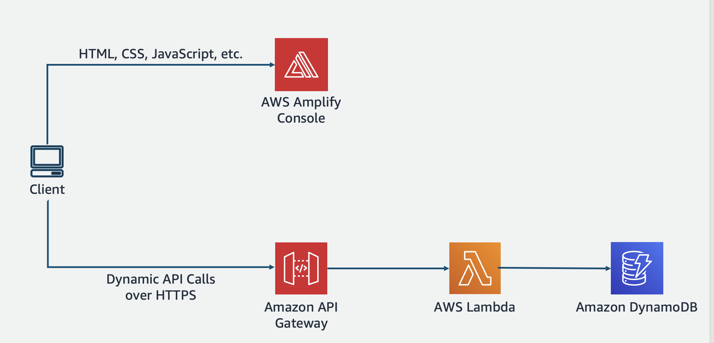

# Your First Serverless Application

_Infrastructure as code framework used_: AWS SAM and AWS Amplify
_AWS Services used_: AWS Lambda, AWS DynamoDB, AWS API Gateway, AWS Amplify

## Summary of the demo

In this demo you will see:

- How to create a simple serverless backend application using AWS SAM
- The backend application will have 2 lambda functions, one Api Gateway and a DynamoDB table
- How to build a REACT Application and host it using AWS Amplify.
- How to connect the backend with the frontend using AWS Amplify client libraries.

## Architecture of the application

This application will get the name of a User and save it in a table.
The user can check if the system has his name registered by checking the table.

All this is done with a React application hosted using AWS Amplify.
The backend is an API Gateway to handle the client requests, a Lambda function to do the business logic and then a DynamoDB table to save all the names.



## Prerequisites for building this solution

1. You need to have an AWS account
   If you don't know how to do it check this [link](https://youtu.be/9_wo0FHtVmY)

2. Then you need to configure your AWS account in your computer and install AWS SAM. Follow this [link](https://aws.amazon.com/serverless/sam/) for instructions

3. Then you need to have AWS Amplify installed and configured in your computer, for that follow this [link](https://docs.amplify.aws/start/getting-started/installation/q/integration/react) for instructions

## Building the BACKEND

Go to the backend directory

```
$ npm install
```

We will be using AWS SAM and make sure you are running the latest version - at the time of writing, this was 1.37.0 (sam --version).

Deploy the project to the cloud:

```
sam deploy -g # Guided deployments
```

When asked about functions that may not have authorization defined, answer (y)es. The access to those functions will be open to anyone, so keep the app deployed only for the time you need this demo running.

Next times, when you update the code, you can build and deploy with:

```
sam deploy
```

After deploying you will get an URL back, and you can use it to test the APIs with Curl or Postman

To check if a name is in the database

````
curl https://<API>/hello?name=Marcia
```

To save a new name to the database
```
curl -X POST https://bqf9incy3e.execute-api.eu-west-1.amazonaws.com/dev/hello?name=Marcia
````

## Building the FRONTEND

1. Go to the client directory and install all dependencies

```
$ npm install
```

2. Run the application

```
$ npm start
```

3. Initialize Amplify

```
$ amplify init
```

4. Copy the index.js

```
$ cp base/index.js src/index.js
```

5. Copy the AWS config file and add the right values in there

```
$ cp base/aws-config.js src/aws-config.js
```

Modify the endpoint with the one you got from deploying the backend.

6. Replace App.js with the one in the base folder

```
$ cp base/App.js src/App.js
```

7. Ready to try locally :)

## Host the frontend app in the cloud

1. Add manual hosting

```
$ amplify init -y
$ amplify add hosting
```

Choose Hosting with Amplify Console
And then select Manual deployment - this means that you will need to republish every time there are changes.

```
$ amplify publish
```

If you want to you can add CI/CD with GitHub, for that you need to host this project in GitHub and then connect it to the Amplify console.

## Clean up

### Delete the backend

```
$ cd backend
$ sam delete
```

Say yes to all the prompts. It will ask you if you want to delete all the S3 buckets and the Cloudformation Stack.

### Delete the client

```
$ cd client
$ amplify delete
```
